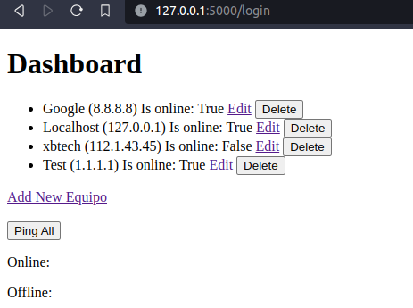
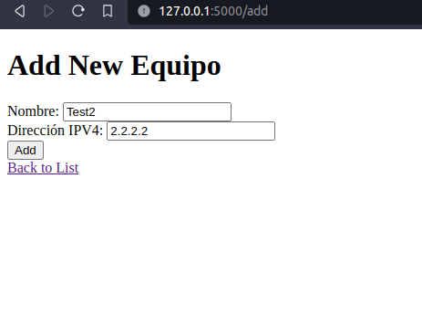
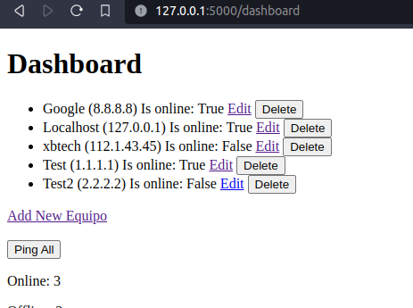
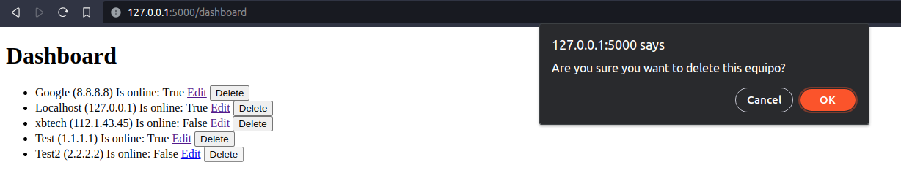
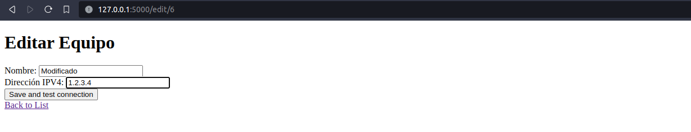
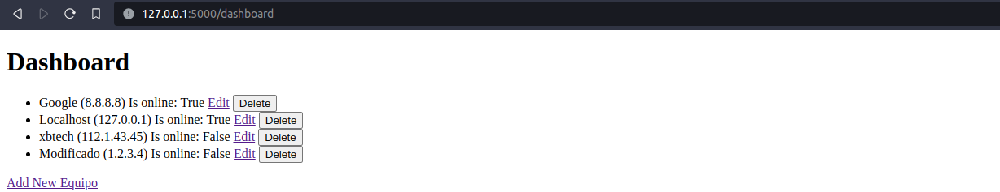
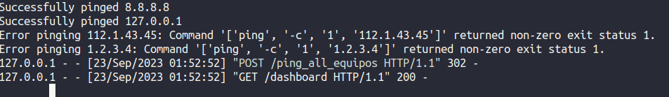
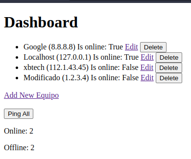

# PruebaBackendEMQU

Para esta prueba decidí utilizar Flask, una instancia local de MySQL y manejar los paquetes usando Conda. El desarrollo se realizó en una computadora corriendo Ubuntu 22.04.

El schema y un conjunto de datos de prueba se encuentran dentro de la carpeta ` /schemas` para recrear la base de datos de MySQL utilizada.

Para importar los paquetes utilizados se debe correr el siguiente comando usando de conda: ```conda env create --name PruebaEMQU_ABC --file=environment.yml```

Para correr la prueba, se deberá navegar a la carpeta del proyecto, en este caso `../PruebaBackendEMQU/`, activar el ambiente de Conda utilizando el comando `conda activate PruebaEMQU_ABC`, y posteriormente correr el comando `python3 run.py` para comenzar el servidor local. 

Una vez corriendo, se debe visitar la dirección IP indicada, en este caso http://127.0.0.1:5000. Una vez ahí se podrá hacer el recorrido del sitio de prueba.

# Areas de oportunidad
- Verificación correcta por medio de correo electrónico.
- Front end usando un CSS o algún framework.
- Hostear la base de datos y el sitio en con algún proveedor.
- Puntualidad para la entrega, planeación de tiempos para la realización del producto.
- Pruebas de código.
- Uso de CI/CD.
- Estandarizar el uso del lenguaje (escojer inglés o español para todo en lugar de mezclarlo tanto).
- Estadísticas más detalladas, uso de gráficas para representarlas.

# Pruebas del programa corriendo
## Dashboard


## Agregar un equipo



## Remover un equipo


## Editar un equipo



## Pingear a los equipos y mostrar los resultados


